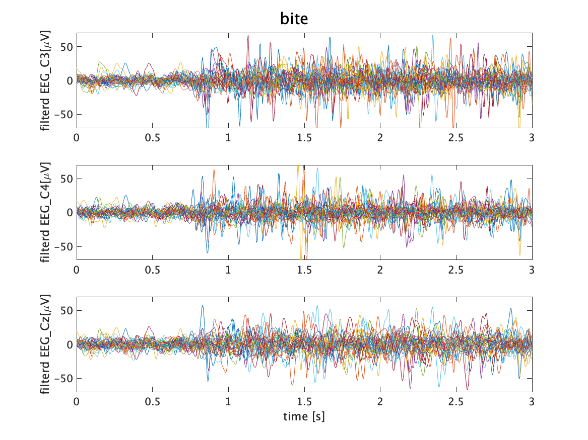
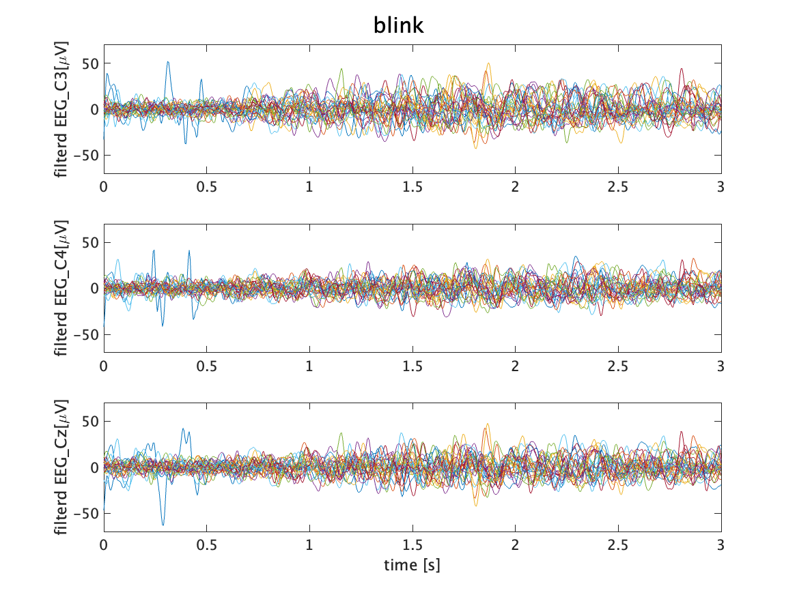
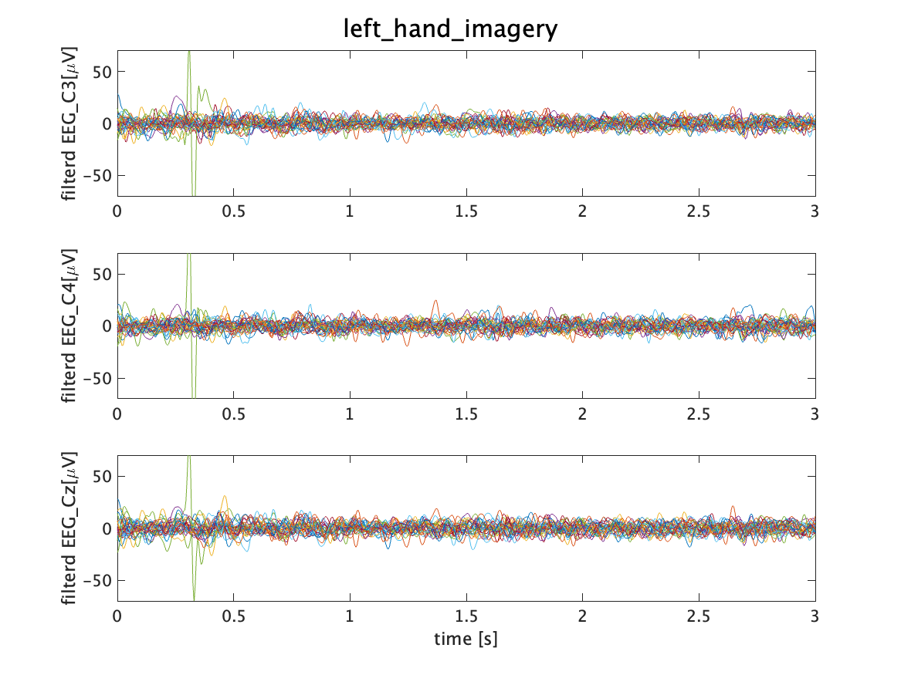

# このサンプルについて
## データセット
1名の被験者が、以下の7種類のタスクを29回ずつ繰り返し実施したデータセットです。
- 開眼安静
- 閉眼安静
- 右手運動
- 左手運動
- 足運動
- 歯噛み
- 瞬き
それぞれ3秒間タスクを継続しています。
立て続けに計測しているため、タスクキューから1秒ぐらい遅れて被験者はタスクを実行しています。

## 入力ファイル
1_testData/01_noize/BraintechAcademy_protc_NNC_30_202301280752.csv
## 出力ファイル 
figs_filterd内にfigure3種類を出力
解析のモデルケースとして、以下の処理を想定しています
1. 各タスク中の波形を描出して、ノイズの頂上しているトライアルや質の低いデータの除去判定
2. 各タスクのpsd平均値の描画。周波数帯ごとの動態確認
3. 時系列でのpsd遷移可視化(t-f map)

# 出力figureの解釈について
## フィルタ済波形の描画
blinkやbiteなどを見ると、1秒遅れで振幅が大きい区間が始まることが確認できます。

その他タスク中の波形から、異常なノイズの混入がないことを確認できます。(左手運動時の0.3秒目あたりにスパイクがありますが、タスク開始前なので一旦無視します)

## PSDの比較
### 閉眼時のalpha増強
執筆中...
### 運動時のERD
執筆中...
## tfmapの観察
執筆中...
